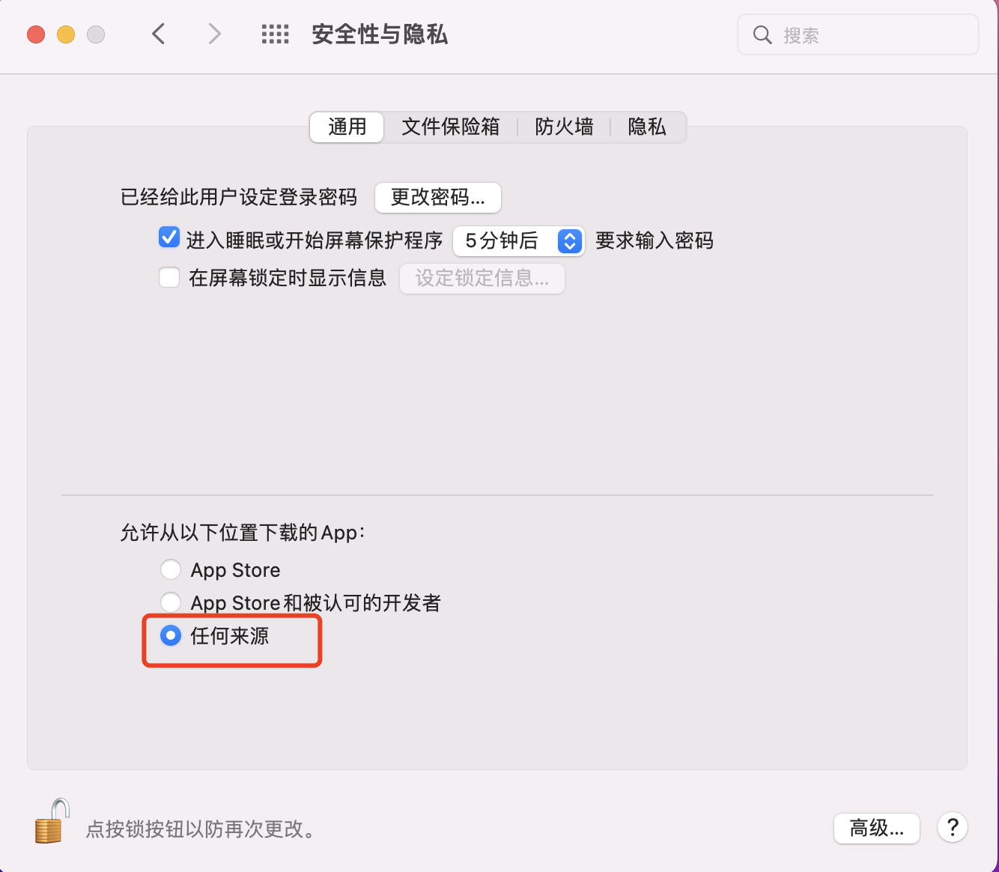

## 无法打开“xxx.app”解决办法

### - 引言

不少 mac 电脑用户经常会在网上下载各种APP，但由于Mac安全性的限制，在安装应用程序时经常会遇到以下情况：

- `无法打开“xxx.app”，因为Apple无法检查其是否包含恶意软件`

导致软件无法打开使用，下面分享如何解决此类问题。

### - 解决方案

1. 首先打开terminal 终端（Terminal.app）

2. 然后在终端中输入以下命令：

```shell
sudo spctl --master-disable
```

> 此代码作用是打开 <系统偏好设置 – 安全性与隐私 – 通用 > 中的【任何来源】

3. 最后输入密码回车（ ⚠️ 密码输入过程是不会显示），然后再重新去打开软件就不会有这个错误提示。

